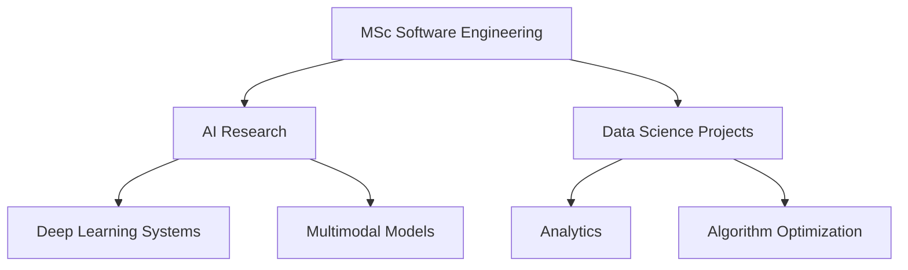

<div align="center">

<!-- Header Banner -->


<!-- Typing SVG (Working & Updated URL) -->
<p align="center">
  
</p>

<!-- Badges -->
<div align="center">
  
  
  
  
</div>

<br>

<!-- Profile Stats -->
<div align="center">
  
  
</div>

</div>

---

<!-- 🐍 Snake Animation (Updated & Working) -->
<div align="center">
  
</div>

---

## 🔥 Most Used Languages
<div align="center">
  
</div>

---

## 🧠 Technical Arsenal

### 🐍 Python & Data Science
<details>
<summary><b>Show Skills</b></summary>
<br>

<div align="center">
  
</div>
</details>

### 🤖 AI & Machine Learning
<details>
<summary><b>Show Skills</b></summary>
<br>

<div align="center">
  
  
</div>
</details>

### 💻 Development & Tools
<details>
<summary><b>Show Skills</b></summary>
<br>

<div align="center">
  
</div>
</details>

### 🗄️ Databases & Cloud
<details>
<summary><b>Show Skills</b></summary>
<br>

<div align="center">
  
</div>
</details>

---

## 🚀 Featured Projects & Portfolio

<div align="center">
  <a href="https://github.com/ZamoRzgar/R1-Omni">
    
  </a>
  <a href="https://github.com/ZamoRzgar/basket-analysis">
    
  </a>
</div>

---

## 🎓 Current Focus

<div align="center">
  

</div>

## 📬 Contact Me

<div align="center">
Professional	Email	GitHub
<a href="https://www.linkedin.com/in/zamo-rzgar-254b9b235/"></a>	<a href="mailto:zamo.rzgar1@gmail.com"></a>	<a href="https://github.com/ZamoRzgar"></a>
</div>
<div align="center"> 
⭐ If you enjoy my work, feel free to star my repositories!
</div> ```
