```mermaid
graph TD
    A[🎓 MSc Software Engineering] --> B[🤖 AI Research]
    A --> C[📊 Data Science Projects]
    B --> D[🧠 Machine Learning Models]
    B --> E[🔮 Deep Learning Applications]
    C --> F[📈 Advanced Analytics]
    C --> G[🛠️ Algorithm Optimization]
    
    style A fill:#ff6b6b
    style B fill:#4ecdc4
    style C fill:#45b7d1
    style D fill:#96ceb4
    style E fill:#ffeaa7
    style F fill:#dda0dd
    style G fill:#98d8c8
```

<div align="center">

<!-- Dynamic Typing Animation Header -->


<!-- Advanced Typing SVG -->
<p align="center">
  <a href="https://git.io/typing-svg">
    
  </a>
</p>

<!-- Enhanced Badges with Animation -->
<div align="center">
  
  
  
  
</div>

<br>

<!-- Profile Views Counter with Style -->
<div align="center">
  
  
</div>

</div>

<!-- Animated Snake eating my contributions -->
<picture>
  <source media="(prefers-color-scheme: dark)" srcset="https://raw.githubusercontent.com/platane/snk/output/github-contribution-grid-snake-dark.svg">
  <source media="(prefers-color-scheme: light)" srcset="https://raw.githubusercontent.com/platane/snk/output/github-contribution-grid-snake.svg">
  
</picture>


<br>

<!-- Most Used Languages -->
<div align="center">
  
</div>

---

##  Technical Arsenal

<details>
<summary><b>🐍 Python & Data Science</b></summary>
<br>
<div align="center">
  
  
  
  
  
  
  
  
</div>
</details>

<details>
<summary><b>🤖 AI & Machine Learning</b></summary>
<br>
<div align="center">
  
  
  
  
  
  
</div>
</details>

<details>
<summary><b>💻 Development & Tools</b></summary>
<br>
<div align="center">
  
  
  
  
  
  
  
  
</div>
</details>

<details>
<summary><b>🗄️ Databases & Cloud</b></summary>
<br>
<div align="center">
  
  
  
  
  
  
</div>
</details>

<!-- Skill Progress Bars -->
<div align="center">
  
</div>

##  Featured Projects & Portfolio

<div align="center">
  
</div>

<!-- Repository Cards Grid -->
<div align="center">
  <a href="https://github.com/ZamoRzgar/R1-Omni">
    
  </a>
  <a href="https://github.com/ZamoRzgar/basket-analysis">
    
  </a>
</div>

<!-- Featured Projects Deep Dive -->
<div align="center">
  
</div>

<table align="center">
<tr>
<td width="50%">

### 🚀 **R1-Omni Highlights**
- 🧠 **Innovation**: Explainable Omni-Multimodal AI
- 🎭 **Focus**: Emotion Recognition with RL
- 📊 **Scale**: Multi-modal video analysis
- 🏆 **Impact**: Advanced reasoning capabilities

### 🔬 **Research Achievements**
- ✅ Implemented reinforcement learning approach
- ✅ Multi-modal fusion (video + audio + text)
- ✅ Explainable AI reasoning processes
- ✅ State-of-the-art emotion detection

</td>
<td width="50%">

### 🛠️ **AI Tech Stack**
```python
# Core ML Frameworks
├── PyTorch 2.5.1
├── Transformers 4.49.0
├── Flash Attention 2.7.4
└── CUDA 12.4

# Model Components
├── SigLIP Vision Encoder
├── Whisper Audio Processing
├── BERT Text Understanding
└── Custom RL Training
```

### 📊 **Model Performance**


</td>
</tr>
</table>

<details>
<summary><b>🔬 Advanced AI Architecture</b></summary>
<br>

```yaml
R1-Omni System Architecture:
│
├── Multi-Modal Input Processing
│   ├── Vision: SigLIP-224 Encoder
│   ├── Audio: Whisper Large-v3
│   └── Text: BERT Base Uncased
│
├── Reinforcement Learning Framework
│   ├── Cold Start Training (580 samples)
│   ├── RLVR Training (15,306 samples)
│   └── Reward-based Optimization
│
├── Explainable AI Engine
│   ├── Reasoning Process Generation
│   ├── Multi-step Emotion Analysis
│   └── Confidence Score Calculation
│
└── Inference & Deployment
    ├── Real-time Video Processing
    ├── Emotion Classification
    └── Explainability Reports
```

**🎯 Key Innovation**: First explainable omni-multimodal emotion recognition system using reinforcement learning, achieving superior performance through reasoning-based training and multi-modal fusion.

</details>

<div align="center">
  
</div>

<table align="center">
<tr>
<td width="50%">

### 🎯 **Project Highlights**
- 🚀 **Performance**: Optimized for sparse datasets
- 📊 **Scale**: 34,070+ transactions analyzed  
- 🎭 **Innovation**: Custom Apriori implementation
- 🏆 **Impact**: 23-32x lift improvement over random

### 📈 **Technical Achievements**
- ✅ Processed 1,559 unique items efficiently
- ✅ Discovered 6 frequent 2-itemsets
- ✅ Generated 12 high-confidence rules
- ✅ Identified key connection patterns

</td>
<td width="50%">

### 🛠️ **Tech Stack Used**
```python
# Core Libraries
├── Python 3.9+
├── NumPy (Numerical Computing)
├── Pandas (Data Manipulation)
├── Matplotlib (Visualization)
└── Custom Algorithms

# Key Features
├── Sparse Matrix Optimization
├── Frequency-based Sorting
├── Association Rule Mining
└── Statistical Analysis
```

### 📊 **Results Dashboard**


</td>
</tr>
</table>

<details>
<summary><b>🔍 Deep Technical Analysis</b></summary>
<br>

```yaml
Project Structure:
│
├── Data Processing Pipeline
│   ├── Raw Transaction Data (34,070 records)
│   ├── Data Cleaning & Preprocessing
│   └── Sparse Matrix Transformation
│
├── Algorithm Implementation
│   ├── Modified Apriori Algorithm
│   ├── Custom Optimization Techniques
│   └── Frequency-based Item Sorting
│
├── Pattern Discovery
│   ├── Frequent Itemset Mining
│   ├── Association Rule Generation
│   └── Statistical Significance Testing
│
└── Results & Visualization
    ├── Performance Metrics
    ├── Pattern Visualizations
    └── Comparative Analysis
```

**🎯 Key Innovation**: Successfully handling extreme sparsity where the most frequent item appears in only 0.42% of transactions - a significant challenge in traditional market basket analysis.

</details>

<!-- Current Focus Section -->
<div align="center">
  
</div>

<div align="center">



</div>


<!-- Interactive Contact Cards -->
<table align="center">
<tr>
<td align="center" width="33%">

### 💼 **Professional**
<a href="https://www.linkedin.com/in/zamo-rzgar-254b9b235/">
  
</a>
<br><br>
*Connect for opportunities*

</td>
<td align="center" width="33%">

### 📧 **Direct Contact**
<a href="mailto:zamo.rzgar1@gmail.com">
  
</a>
<br><br>
*Quick email response*

</td>
<td align="center" width="33%">

### 🐙 **Open Source**
<a href="https://github.com/ZamoRzgar">
  
</a>
<br><br>
*Explore my repositories*

</td>
</tr>
</table>

<!-- Collaboration Call-to-Action -->
<div align="center">
  
</div>

<div align="center">

**I'm currently interested in:**
- 🤖 **AI/ML Research Projects** - Deep Learning & Neural Networks
- 📊 **Data Science Collaborations** - Advanced Analytics & Insights
- 🚀 **Open Source Contributions** - Algorithm Development
- 🎓 **Academic Research** - Software Engineering Innovations
- 💡 **Tech Mentorship** - Sharing knowledge with the community

</div>

---

<!-- Footer with Quote and Stats -->
<div align="center">
  
</div>

<div align="center">
  
  
  
  <br><br>
  
  <h3>💡 "The goal is to turn data into information, and information into insight."</h3>
  <p><i>- Carly Fiorina</i></p>
  
  <br>
  
  <h4>⭐ If you like my work, consider giving my repositories a star!</h4>
  
</div>

<!-- Easter Egg: Hidden Konami Code -->
<!-- ↑ ↑ ↓ ↓ ← → ← → B A -->

<!--
**ZamoRzgar/ZamoRzgar** is a ✨ _special_ ✨ repository because its `README.md` (this file) appears on your GitHub profile.

Here are some ideas to get you started:

- 🔭 I’m currently working on ...
- 🌱 I’m currently learning ...
- 👯 I’m looking to collaborate on ...
- 🤔 I’m looking for help with ...
- 💬 Ask me about ...
- 📫 How to reach me: ...
- 😄 Pronouns: ...
- ⚡ Fun fact: ...
-->
